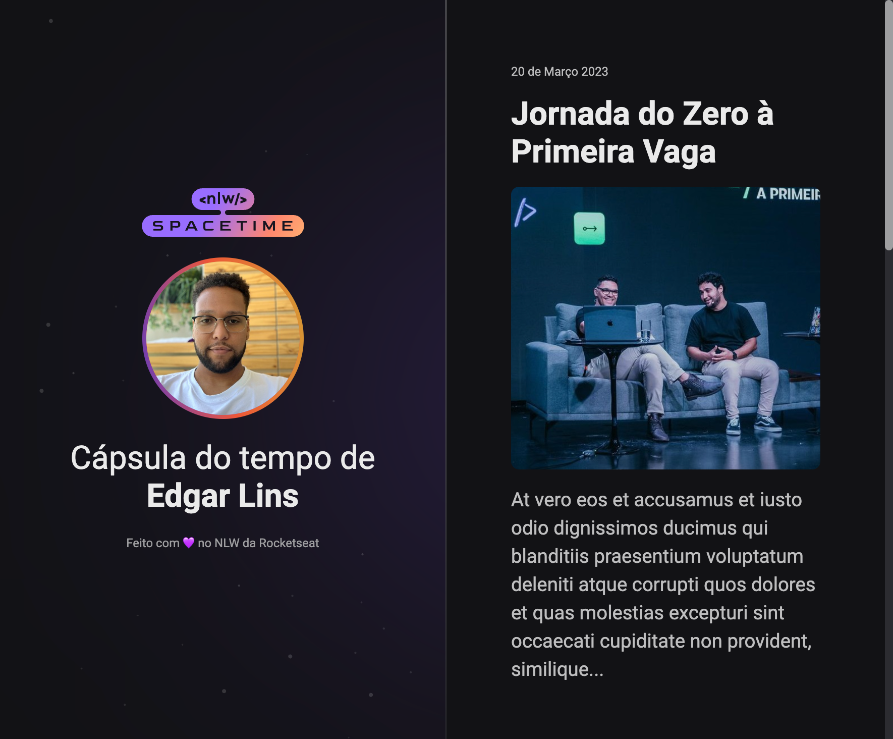

# NLW - Spacetime

> Evento Explorer | Rocketseat

Projeto desenvolvido no curso Explorer da rocketseat

* Construção de uma aplicação WEB completa.

[🔗 Clique aqui para acessar](https://edgar-lins.github.io/rocketseat-explorer-desafio-avancado/)

## 🛠 Tecnologias

- HTML
- CSS
- Github

## 📩 Contato

linss.edgar@gmail.com